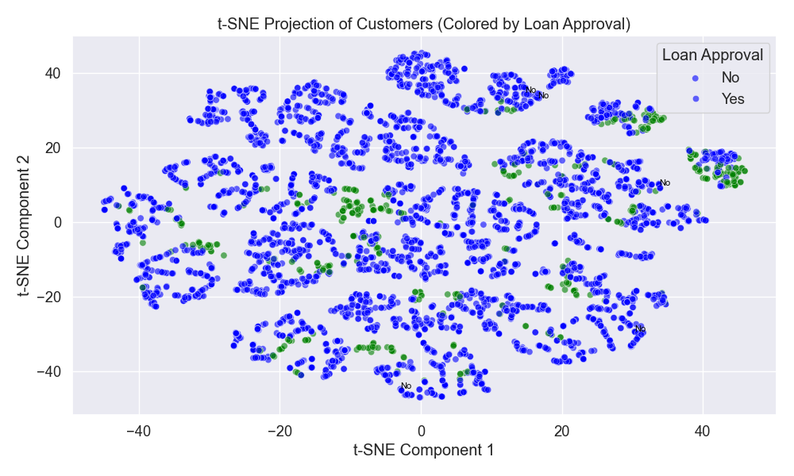

# 🏦 Personal Loan Approval Prediction (AI Final Project)

This project predicts whether a customer is likely to be approved for a personal loan using real-world financial data. We build and compare four classification models, address class imbalance, and use t-SNE to visualize high-dimensional customer profiles.

---

## 📁 Project Structure

```
loan-approval-prediction-AI/
│
├── Bank_Personal_Loan_Modelling.xlsx       # Original dataset
├── imbalanced-personal-bank-loan-classification.ipynb  # Main analysis notebook
├── results/
│   └── tsne_loan_projection.png            # t-SNE visualization of customer data
├── README.md                               # This file
```

---

## 🚀 Getting Started

### ✅ Clone the repository

```bash
git clone https://github.com/moondongkun/loan-approval-prediction-AI.git
cd loan-approval-prediction-AI
```

### ✅ Install dependencies

You can either use `requirements.txt` (if added), or install packages manually:

```bash
pip install pandas numpy matplotlib seaborn scikit-learn xgboost openpyxl
```

---

## 📊 Models Compared

- **Complement Naive Bayes (CNB)**
- **Bernoulli Naive Bayes (BNB)**
- **Logistic Regression** (with elastic net regularization)
- **XGBoost** (best performance)

### Evaluation Metrics:
- **F1 Score**, **Recall**, **Precision**, and **AUC**

---

## 🔍 Feature Engineering & Preprocessing

- Handled outliers (negative experience, extreme mortgage)
- Performed binning, scaling, and feature selection
- Used **Drop-Column importance** to rank features

📌 Key predictors:
- `Education`, `Income`, `Family`, `CCAvg`, `CD Account`

---

## 🌐 Visualizations

- Generated a 2D **t-SNE projection** of customer feature space
- Visualized class separability between loan-approved and rejected profiles



---

## ✅ Results

| Model | F1 Score | Recall | Precision | AUC    |
|-------|----------|--------|-----------|--------|
| CNB   | 0.54     | 0.94   | 0.38      | 0.73   |
| BNB   | 0.59     | 0.88   | 0.45      | 0.73   |
| LR    | 0.69     | 0.83   | 0.59      | 0.79   |
| **XGB** | **0.94** | **0.95** | **0.93** | **0.96** |

---

## 📌 Purpose

- Demonstrate real-world application of machine learning to financial decision-making
- Explore interpretability, feature importance, and data imbalance handling
- Completed as part of AI course final project at **Seoul National University**

---

## 🧑‍💻 Author

**문동건**  
Seoul National University, 자유전공학부 (AI Final Project, 2025)

---

## 📝 License

This repository is provided for academic purposes. No official license applied.
